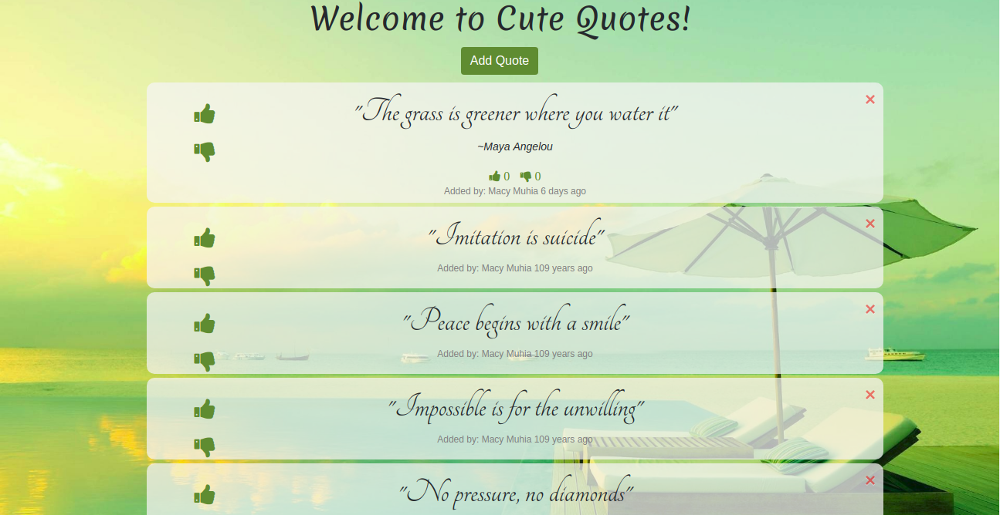

# Cute Quotes


#### Check out Bella Pizzeria [here](https://macymuhia.github.io/Cute-Quotes/)

Last modified 10th July 2019.
#### By **Mercy Muhia**
## Description
Cute Quotes is an application that allows users to add quotes and users can upvote or downvote a quote.
## Project Behaviour
* A user can view existing quotes
* A user can view quote author and number of upvotes and downvotes
* A user can upvote or qownvote quotes
* A user can delete a quote
* A user can add new quotes
* The quotes with the highest upvotes should be highlighted.

## Technologies Used
HTML, CSS (Bootstrap) and [Angular CLI](https://github.com/angular/angular-cli) version 8.0.6.

## Setup/Installation Requirements
git clone https://github.com/macymuhia/Cute-Quotes.git

```cd quotes```

## Development server

Run `ng serve` for a dev server. Navigate to `http://localhost:4200/`. The app will automatically reload if you change any of the source files.

## Code scaffolding

Run `ng generate component component-name` to generate a new component. You can also use `ng generate directive|pipe|service|class|guard|interface|enum|module`.

## Build

Run `ng build` to build the project. The build artifacts will be stored in the `dist/` directory. Use the `--prod` flag for a production build.

## Running unit tests

Run `ng test` to execute the unit tests via [Karma](https://karma-runner.github.io).

## Running end-to-end tests

Run `ng e2e` to execute the end-to-end tests via [Protractor](http://www.protractortest.org/).

## Further help

To get more help on the Angular CLI use `ng help` or go check out the [Angular CLI README](https://github.com/angular/angular-cli/blob/master/README.md).

## Support and contact details
To contribute, submit a pull request. 
For questions or concerns, reach out on mercy8muhia@gmail.com
### License
*MIT*

### &copy; 2019 Mercy Muhia